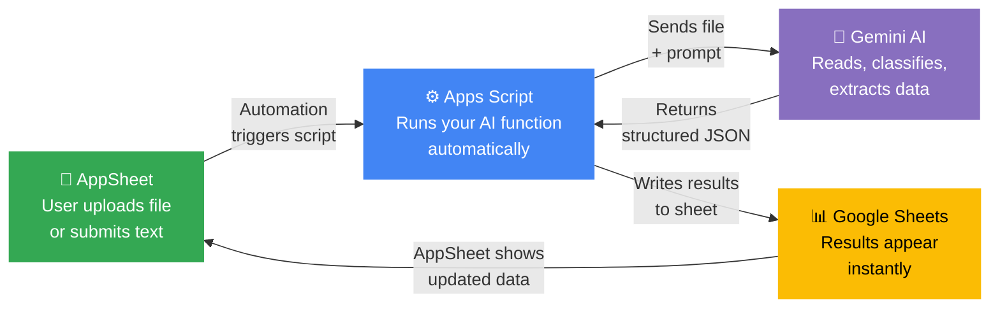

# Your AppSheet App Just Got an AI Brain 🧠⚡

**Give your AppSheet app the power to read documents, classify files, and understand text — with 1 script and zero coding experience required.**

This starter kit connects AppSheet to Google's Gemini AI through Apps Script. Upload a file in your app, and AI tells you what it is, pulls out the data you need, and writes it back to your sheet. All inside the Google ecosystem — no third-party tools, no monthly fees.

[](LICENSE)
[](https://script.google.com)
[](https://ai.google.dev)

---

## 🏗 What You Can Build

### 📄 Instant Invoice Processing
Your field team uploads a photo of an invoice in AppSheet. AI reads it and fills in the vendor name, invoice number, total amount, and date — no manual typing.

### 💬 Smart Customer Feedback
A customer submits a complaint through your AppSheet form. AI instantly tags it as "Negative — Delivery Issue" and routes it to the right team.

### 📸 Photo Quality Inspection
A factory worker takes a photo of a finished product. AI checks it against your spec and flags "Scratch on top-left corner — Confidence: 87%."

### 🗂 Automatic Document Filing
Someone drops a PDF into a shared Drive folder. AI reads it and fills in: *"Type: Safety Data Sheet, Language: German, Summary: Chemical handling guidelines for Product X."*

---

## 🔄 How It Works



**In plain English:**
1. A user does something in AppSheet (uploads a file, adds a row, taps a button)
2. An AppSheet automation calls your Apps Script function
3. Apps Script sends the file to Gemini AI with instructions ("classify this" or "extract the invoice number")
4. Gemini returns the answer as structured data
5. Apps Script writes the results back to Google Sheets
6. AppSheet displays the updated data — the user sees it instantly

---

## ⚡ Quick Start

> **Total time: ~10 minutes.** You need a Google account and an AppSheet app connected to a Google Sheet.

### Step 1 · 2 min · Get your free API key

1. Go to **[Google AI Studio](https://aistudio.google.com/apikey)**
2. Click **Create API Key**
3. Copy it somewhere safe — you'll paste it in the next step

### Step 2 · 3 min · Add the script to your sheet

1. Open the Google Sheet that powers your AppSheet app
2. Click **Extensions → Apps Script**
3. Delete everything in the default `Code.gs` file
4. Open [`src/Code.js`](src/Code.js) from this repo → copy all of it → paste it in
5. Click the ⚙️ **Project Settings** gear icon
6. Scroll to **Script Properties** → click **Add script property**
7. Set the key to `GEMINI_API_KEY` and paste your API key as the value
8. Click **Save**

### Step 3 · 1 min · Verify it works

1. Back in the Apps Script editor, click the function dropdown → select **`testConnection`**
2. Click **▶ Run** (grant permissions if prompted)
3. Open the **Execution Log** — you should see:
   ```
   ✅ Connection successful
   ```

### Step 4 · 4 min · Connect AppSheet

1. In your AppSheet app, go to **Automation → Bots**
2. Create a new Bot
3. Set the **Event** (e.g., "When a new row is added" or "When a column changes")
4. Add a **Task** → choose **"Call a script"**
5. Select your Apps Script project
6. Pick the function you want (e.g., `classifyDocument`)
7. Map the file ID column from your table to the function parameter
8. Save and test — upload a file and watch AI fill in the results

**Done.** Your AppSheet app now has AI. 🎉

---

## 🗂 Functions

| Function | What it does | You give it | You get back |
|----------|-------------|-------------|-------------|
| `classifyDocument(fileId)` | Reads a file and tells you what type of document it is | A Google Drive file ID | `{ type: "Invoice", language: "EN", summary: "...", confidence: 92 }` |
| `extractData(fileId, fields)` | Pulls specific data points out of a document | File ID + list of fields like `["vendor", "date", "amount"]` | `{ vendor: "Acme Corp", date: "2026-03-15", amount: "$4,200" }` |
| `summarizeDocument(fileId)` | Reads a document and gives you the highlights | A Google Drive file ID | `{ title: "...", summary: "...", key_points: [...] }` |
| `analyzeText(text)` | Reads text and tells you the sentiment and topic | Any text string | `{ sentiment: "Positive", category: "Product Review", tags: [...] }` |

### Quick code examples

**Classify a document:**
```javascript
// Pass a Google Drive file ID — get back the document type, language, and a summary
const result = classifyDocument("1BxiMVs0XRA5nFMdKvBdBZjgmUUqptlbs");
Logger.log(result.type);       // "Invoice"
Logger.log(result.confidence); // 92
```

**Extract invoice data:**
```javascript
// Tell it what fields to look for — it pulls them from the document
const data = extractData("1BxiMVs...", ["company_name", "invoice_number", "total"]);
Logger.log(data.company_name); // "Acme Corp"
Logger.log(data.total);        // "$4,200.00"
```

**Analyze customer feedback:**
```javascript
// Pass any text — get back sentiment, category, and tags
const feedback = analyzeText("The delivery was late and the package was damaged");
Logger.log(feedback.sentiment); // "Negative"
Logger.log(feedback.category);  // "Delivery Issue"
```

---

## 📎 Supported File Types

| File type | What happens |
|-----------|-------------|
| **PDF** | Sent directly to AI — works great |
| **Images** (PNG, JPG, HEIC) | Sent directly — perfect for photos from AppSheet |
| **Google Docs** | Auto-converted to PDF, then sent |
| **Google Sheets** | Auto-converted to PDF, then sent |
| **Google Slides** | Auto-converted to PDF, then sent |

> **Tip:** For best results with photos, make sure the image is clear and well-lit. Gemini reads text in images too (OCR built-in).

---

<details>
<summary><strong>🔧 Advanced: API Options & Configuration</strong></summary>

### Changing the AI model

The default model is `gemini-2.0-flash-lite` — fast and free. You can switch to a more powerful model:

```javascript
const result = callGemini("Describe this in detail", {
  model: "gemini-2.0-flash",     // More capable model
  temperature: 0.8,               // Higher = more creative responses
  maxTokens: 4096                  // Longer responses
});
```

| Option | Default | What it controls |
|--------|---------|-----------------|
| `model` | `gemini-2.0-flash-lite` | Which Gemini model to use |
| `temperature` | `0.2` | How creative the response is (0 = factual, 1 = creative) |
| `maxTokens` | `2048` | Maximum length of the response |

### Low-level API functions

These are the building blocks used by `classifyDocument()`, `extractData()`, etc.:

| Function | When to use it |
|----------|---------------|
| `callGemini(prompt, options)` | Send a text-only question to Gemini |
| `callGeminiWithFile(prompt, fileId, options)` | Send a question + a file (image, PDF, doc) |
| `callGeminiJSON(prompt, fileId, options)` | Same as above, but forces a structured JSON response |

### Reliability

The script handles common issues automatically:
- **Rate limits** — If Google throttles your requests, the script waits and retries up to 3 times with increasing delays
- **JSON parsing** — Gemini sometimes wraps JSON in markdown code blocks — the script handles both formats
- **File conversion** — Google Workspace files (Docs, Sheets, Slides) are auto-exported to PDF before sending to Gemini

### Script Properties

| Key | Required | Description |
|-----|----------|-------------|
| `GEMINI_API_KEY` | ✅ | Your Gemini API key from [AI Studio](https://aistudio.google.com/apikey) |

</details>

---

## ❓ FAQ

**"Is this really free?"**  
Yes. Apps Script is free. The Gemini API free tier gives you 15 requests per minute — that's plenty for most AppSheet apps. You only pay if you exceed millions of requests.

**"I'm not a developer. Can I still set this up?"**  
Absolutely. You're copying one file and pasting one API key. If you've ever added a formula in Google Sheets, you can do this.

**"Will this work with my existing AppSheet app?"**  
Yes. As long as your app uses a Google Sheet as its data source, you can add this to the same Sheet's Apps Script.

**"What happens if the AI gets it wrong?"**  
Every response includes a `confidence` score (0-100). You can set up your AppSheet app to flag low-confidence results for human review — just add a rule like "If Confidence < 70, mark as Needs Review."

**"Can I customize what the AI extracts?"**  
Yes. The `extractData()` function takes a list of field names. Pass whatever you need: `["po_number", "ship_date", "line_items"]` — Gemini figures out where to find them.

**"Does this send my data to OpenAI or a third party?"**  
No. Everything stays in the Google ecosystem. Your files go from Google Drive → Google's Gemini API → back to Google Sheets. No third-party services involved.

---

## 👤 Author

**Islom Ilkhom** — Google Workspace & GCP Automation Expert

I build production automation systems with AppSheet, Apps Script, and Gemini AI for manufacturing, operations, and document processing.

[LinkedIn](https://linkedin.com/in/islomilkhomov) · [GitHub](https://github.com/IslomIlkhom)

---

## 📄 License

MIT — use it, modify it, share it. Attribution appreciated but not required.
